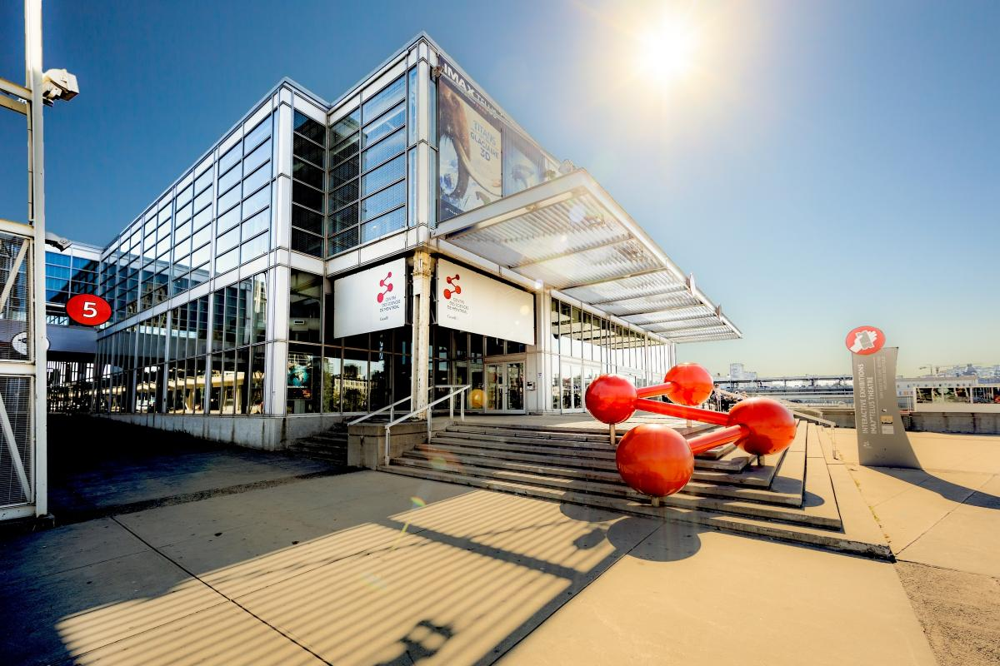
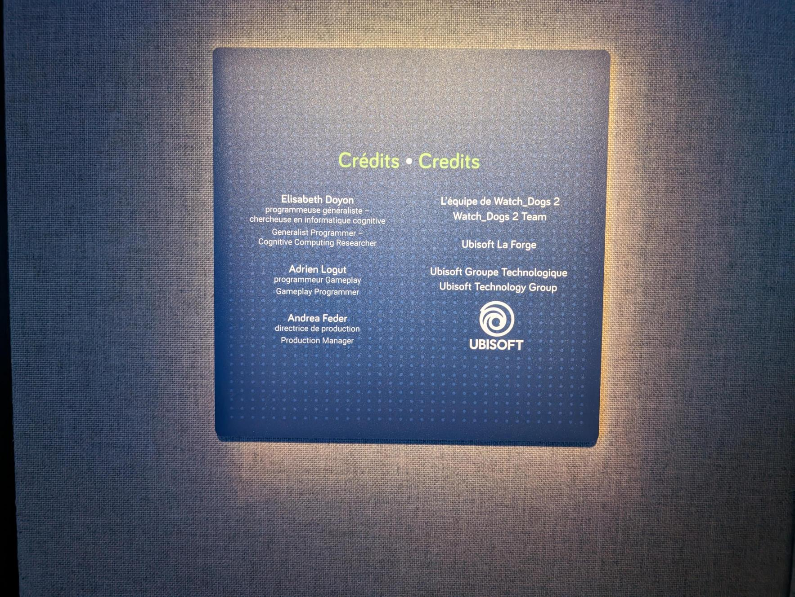
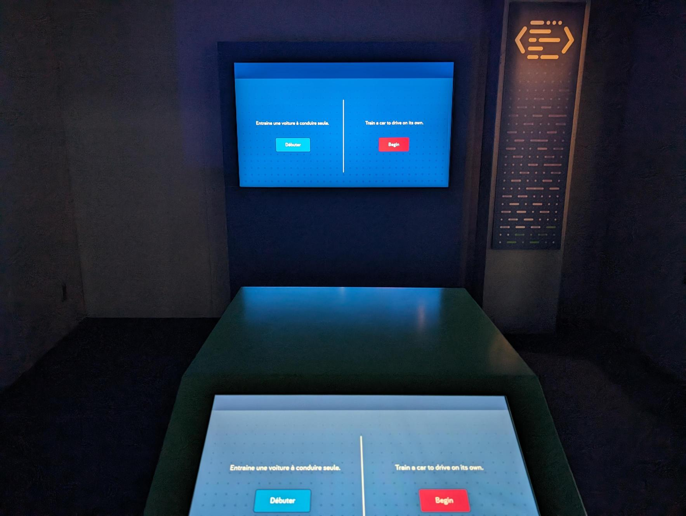
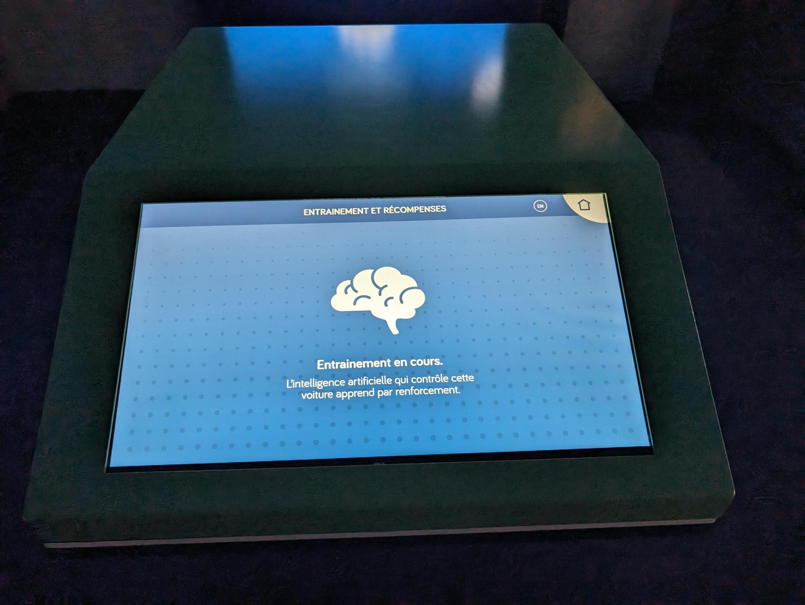
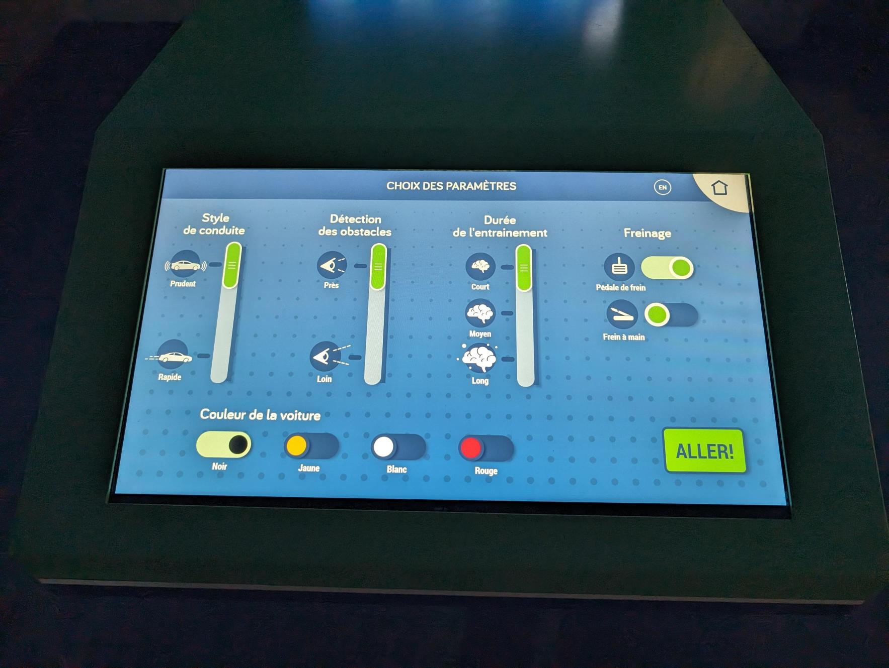
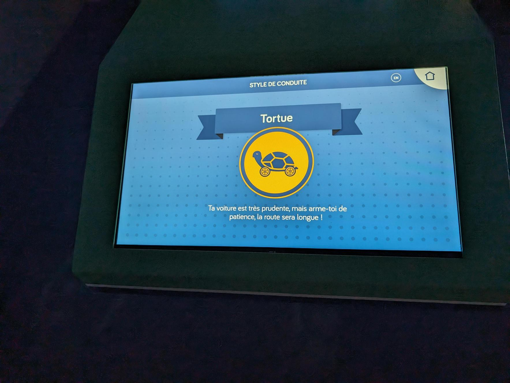

e# Centre des sciences

## Nom de l'exposition ou de l'événement
Centre des sciences

source: <https://www.centredessciencesdemontreal.com/expositions>

## Lieu de mise en exposition
Centre des sciences à Montréal

## Type d'exposition
Permanente, intérieure

## Date de visite
5 avril 2024

 
## Titre de l'oeuvre
Centre des sciences (Oeuvre conduite IA)

 
## Nom des artistes

## Année de réalisation	
Pas inscris

## Description de l'oeuvre
Cet oeuvre intéractif consiste a apprendre à une "intelligence artificielle" à conduire une voiture. Pour faire cela, il y a un écran tactile ayant des paramêtres que nous pouvons modifier. 
Cet oeuvre sert de divertissement pour un public plus jeune et aussi d'un aperçu de l'IA (intelligence artificielle)

## Type d'installation
Interactive

## Fonction du dispositif multimédia
Support pédagogique

## Mise en espace
Cet oeuvre comporte deux écrans qui se situent dans une petite salle noire.
(Voir démo plus bas)

## Composantes et techniques	
Cet oeuvre se sert de deux écrans. L'écran tactile prend les informations donné pour générer une simulation qui serait affiché sur le grand écran.

## Éléments nécessaires à la mise en exposition	
- 2 écrans (1 tactile)
- Salle sombre
- fils
- cache fils

## Expérience vécue
Le visiteur est attendu à jouer le jeu en intéragissant avec l'écran et a essayer plusieurs combinaisons pour avoir une voiture qui conduit idéalement. 
J'ai trouvé cet oeuvre plus amusant que d'autres mais ce n'était rien de spectaculaire.
démo: <https://github.com/TerryLTY/H24_V11_inspirations_LU/assets/143763387/1fbf570e-edda-4b44-8d90-fd5ba5b7cdd5>

## Ce qui m'a plus
J'ai aimé l'interactivité et le divertissement fourni de cet expérience.

## Éléments que j'ai moins apprécié
Je pense que le programme peu être plus profond et mieux développé pour une expérience plus complête.

## Références: 
Centre des sciences - <https://www.centredessciencesdemontreal.com/expositions>
