# Crescentia 
## Qu'est-ce Crescentia? 
Crescentia, qui signifie « croissance » en latin, met de l'avant le concept d'évolution qui apparaît sous plusieurs facettes, que ce soit de manière organique, environnementale, ou encore psychologique. C'est aussi le nom de l'exposition finale des étudiants en techniques d'intégration multimédia du Collège Montmorency dont les œuvres explorent ce concept de plusieurs manières. Ce sont des créations en perpétuel mouvement, qui évoluent et se transforment au gré des actions des visiteurs. 
source: <https://tim-montmorency.com/2024/>

### Info de visite
- **Date de visite:** 20 fevrier (1re)
- **Lieu de mise en exposition:** grand studio et petit studio
- **Année de réalisation:** 2024
- **Type d'exposition:** temporaire, intérieure
- **Type d'installation:** interactive
- **Fonction du dispositif multimedia:**

  

### Mise en espace
Grand studio (pièce à gauche) et Petit studio (pièce à droite)

- Rhizomatique occupe le coté gauche du grand studio, ils utilisent une zone de controle en mèshe et le cyclorama pour afficher l'image
- Effet Papillon occupe toute l'espace derrière la vitre dans le petit studio
- KIGO occupe le devant du grand studio, ils utilisent une zone au sol marqué par du ruban adhésif et le mur pour afficher l'image
- Sonalux occupe le fond du grand studio, ils utilisent deux petits mur en combinaison du mur de fond pour faire un cubicule afin d'afficher l'image avec un panneau de contrôle
- Canevas Cosmique occupe la droite du grand studio, ils utilisent une table (le canevas) et le mur droit pour afficher l'image

### Élement nécessaire à la mise en exposition général
Tout les oeuvres du projet Crescentia utilisent des projecteurs.

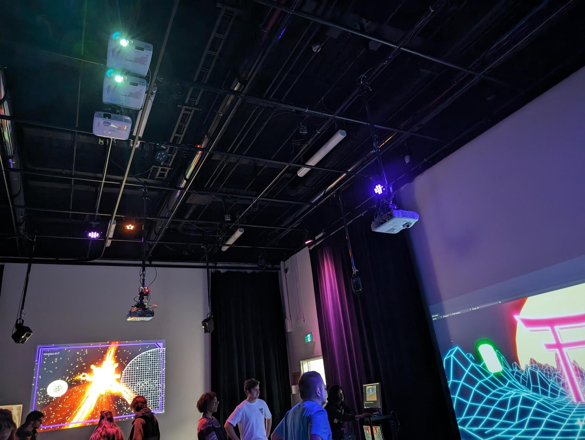

### Expérience vécue
L'expérience que j'ai vecu à Crescentia était pas mal plaisant. Lors de la visite, les artistes étaient accueillant, patient et répondais au questions que je les posais. Quelques un m'ont même donné des conseils pour des futurs projets. 
J'ai plus pris des photos que j'ai intéragis avec les oeuvres mais je les trouvais intéressants et impréssionants.

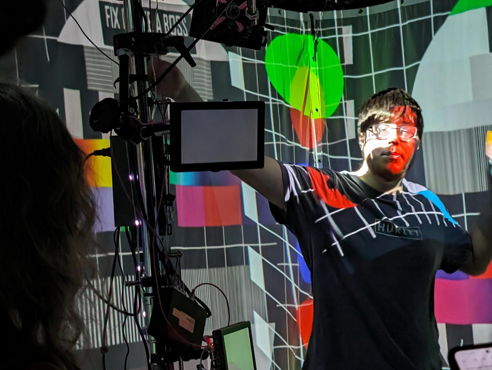

# Rhizomatique
Membres: Jolyanne Desjardins, MaÏka Désy, Laurie Houde, Felix Testa Radovanovic, 

**Description de l'oeuvre:**  
Rhizomatique est une oeuvre intéractive qui relie l'humain et le temps. De nos jours, le temps controle notre vie, on est souvent occupé et la vie va trop vite. Le temps est un fil qui ralonge selon différentes temporalités, actions ou événements dans la vie. Dans notre projet, en appuyant sur la toile l'interacteur naviguera dans le cerveau pour y découvrir ses souvenirs, qui vont par la suite être révellés sur les projections immersives.  
source: <https://tim-montmorency.com/2024/projets/Rhizomatique/docs/web/index.html>

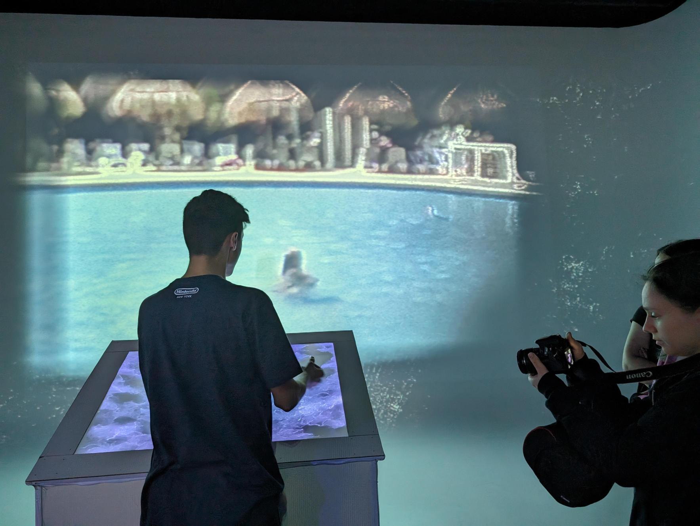

**Composantes et techniques:**
Les artistes se sont servi de la kinect et du tissu pour envoyer de l'information au programme. La superficie du contact sur le tissu sert pour afficher les videos (souvenirs)

**Éléments nécessaires à la mise en exposition:**
- Maille en tissu
- Table
- Cyclorama
- Kinect

**Ce que j'ai aimé 👍:**  
- Concept intéressant
  
**Ce que j'ai pas aimé 👎:**  
- Exécution décevant (Tissu ne sert pas a grand chose à mon avis)
- Cyclorama mal utilisé

  
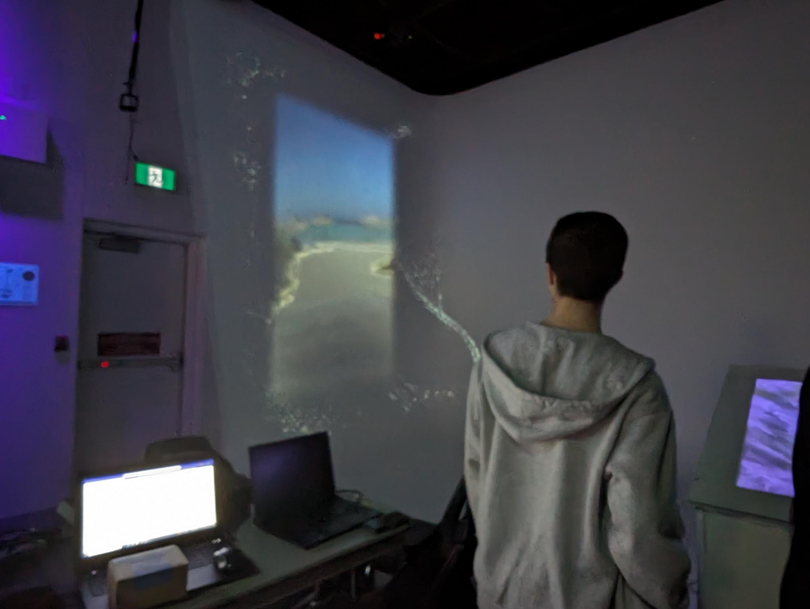

# Effet Papillon
Membres: Raphaël Dumont,  Alexis Bolduc,  William Morel, Alexia (Ryan) Papanikolaou, Viktor Zhuralev, Jasmine Lapierre

**Description de l'oeuvre:**  
Une installation interactive immersive qui explore le cycle de vie d'un pommier tout en mettant en lumière l'effet papillon à travers des éléments électroniques. Les visiteurs sont invités à participer à une expérience sensorielle et éducative qui dévoile les différentes étapes, de la graine à la pomme, tout en soulignant la notion complexe de l'effet papillon. La maturation du fruit est une phase clé de l'installation, où les visiteurs découvrent les conséquences finales de leurs actions. La pomme résultante devient le point focal, représentant les retombées de choix apparemment minuscules sur un système complexe.  
source: <https://tim-montmorency.com/2024/projets/Effet-Papillon/docs/web/index.html>

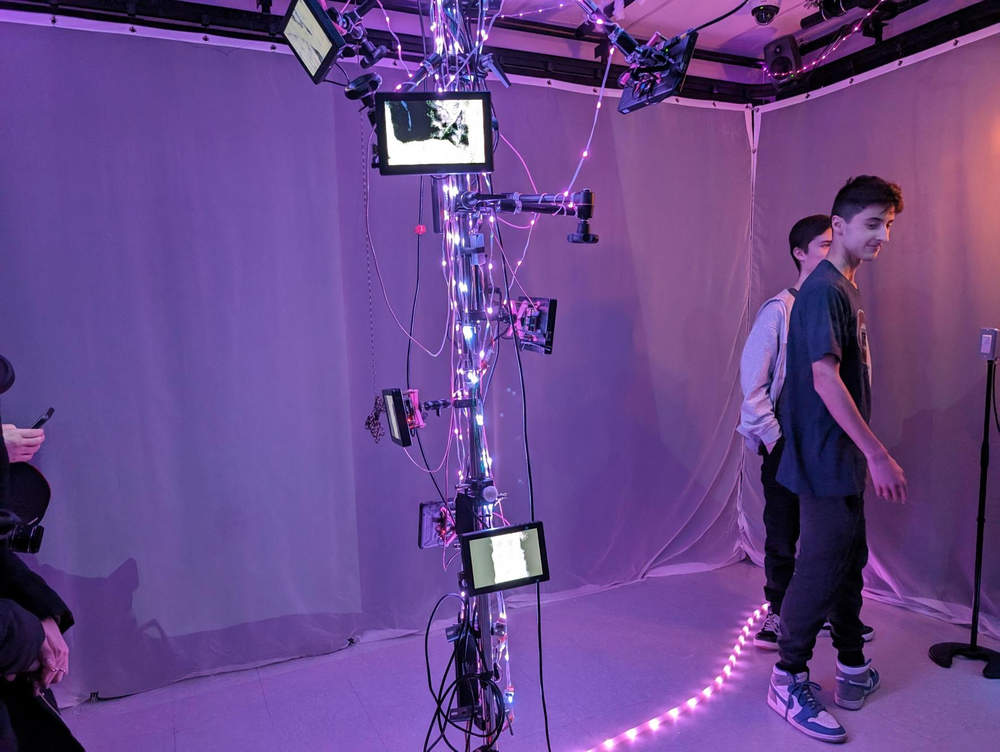

**Composantes et techniques:**
Les artistes ont mis des contraptions qui doivent être activé dans un ordre. Ces contraptoins envoient des signaux qui activent affichage de l'arbre dans les écrans et les sons. 

**Éléments nécessaires à la mise en exposition:**
- Lumières LED
- Écrans
- Couverture de mur
- Contraptions d'activation

**Ce que j'ai aimé 👍:**  
- Démarche et intéraction pour l'oeuvre
- Son et Ambiance
- Divers Écrans qui forme l'arbre

**Ce que j'ai pas aimé 👎:**  
- Salle d'exposition étroit et pas spacieux

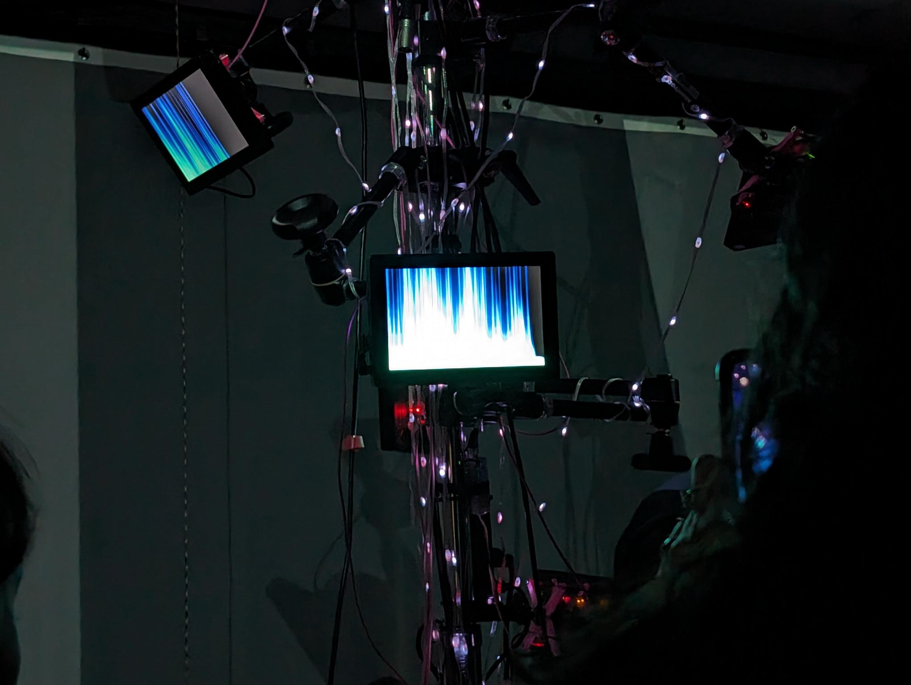

# KIGO
Membres: Érick Ouellette, William Rathier Mailly, Gabriel Clerval, Nicolas St-Martin, Antoine Dion

**Description de l'oeuvre:** 
Un jeu interactif oû le joueur doit éviter des obstacles dans un univers inspiré du style visuel néon rétro, dans lequel l'esthétique changera pour s'associer aux quatres saisons.  
source: <https://tim-montmorency.com/2024/projets/Kigo/docs/web/index.html>

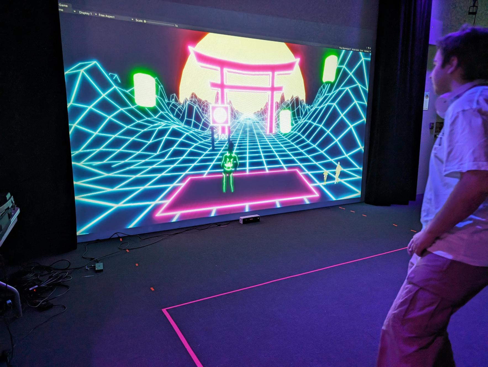

**Composantes et techniques:**
Les artistes se servent de la kinect pour détecter les mouvements du joueur qui serait transmis dans le programme (Unity) qui mets les points de mouvements sur le personnage du jeu. 

**Éléments nécessaires à la mise en exposition:**
- Rubans adhésifs
- Kinect

**Ce que j'ai aimé 👍:**  
- Intéractivité (Jeu)
- Esthétique
- Utilise bien le kinect

**Ce que j'ai pas aimé 👎:**  
- Difficulté du jeu monte trop vite

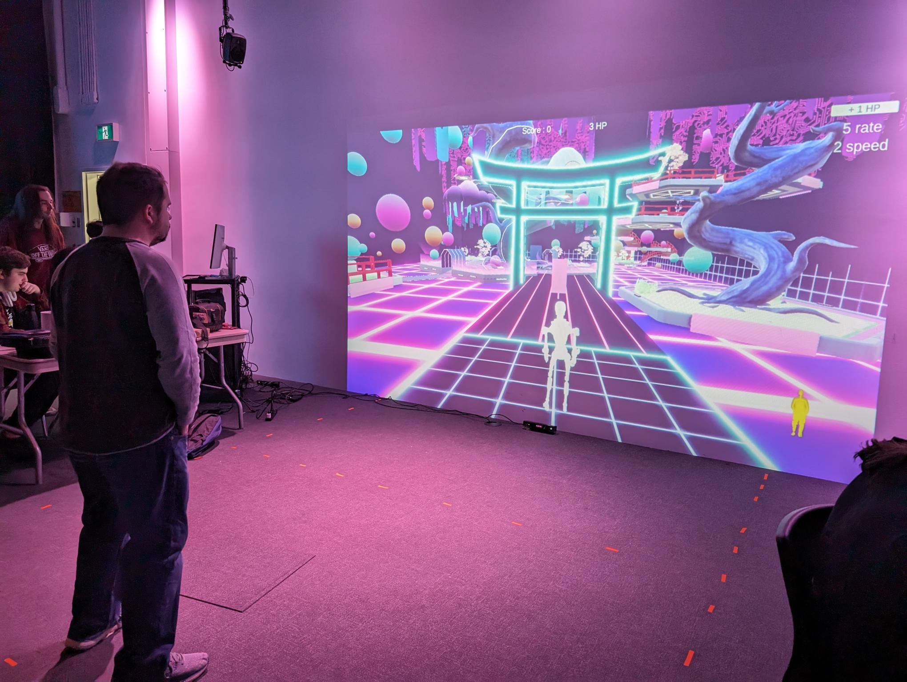

# Sonalux
Membres: Antoine Haddad, Camélie Laprise, Ghita Alaoui, Vincent Desjardins, 

**Description de l'oeuvre:**  
Sonalux est une installation qui dépasse les limites du réel pour proposer un monde d'art génératif où la notion du temps est repensé dans une boucle laissant place à un voyage astral collectif. L'interacteur se voit projeter dans un espace sans contraintes où il en devient le maître par la maîtrise des pièces d'instruments qui se trouvent sur le podium.  
source: <https://tim-montmorency.com/2024/projets/Sonalux/docs/web/index.html>

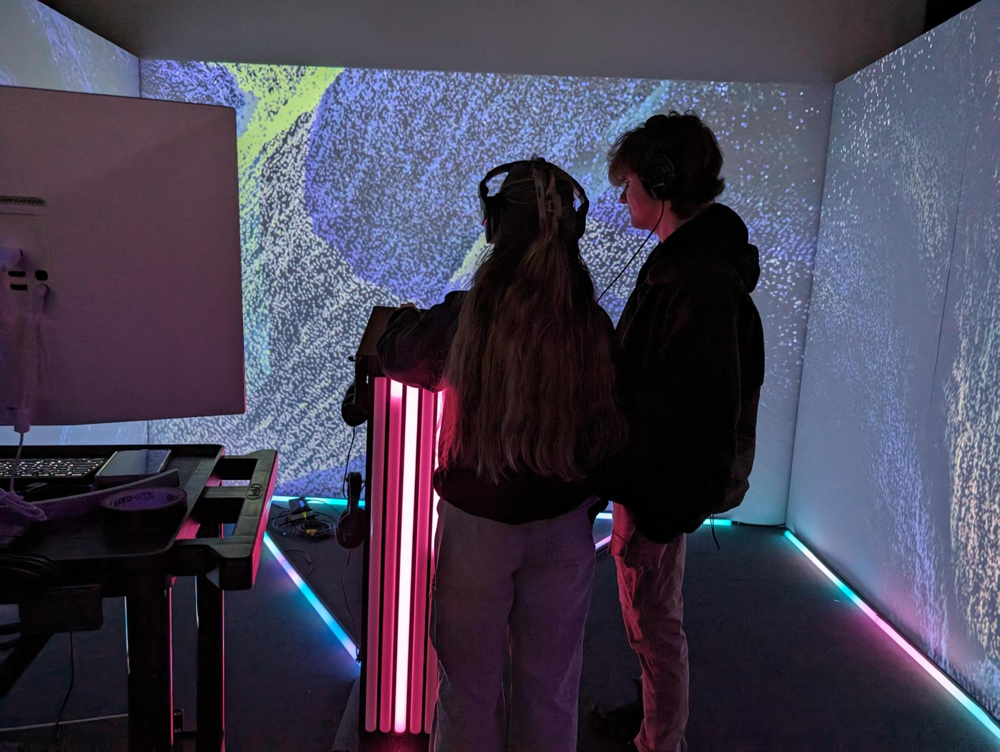

**Composantes et techniques:**  
Les artistes ont mis des boutons pour modifier les paramêtres de l'affichage dans le programme qui émettra des sons dépendemment des configurations.

**Éléments nécessaires à la mise en exposition:**
- Table
- Boutons et batons lumineux
- Murs
- Écouteurs

**Ce que j'ai aimé 👍:**  
- Tactilité (boutons)
- Viuels et projection bien réalisé

**Ce que j'ai pas aimé 👎:**  
- Manque d'utilité pour les batons lumineux
  

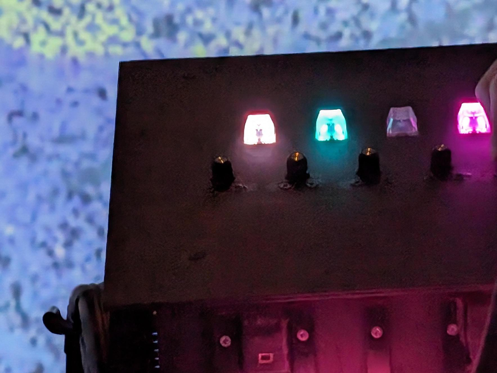

# Canevas Cosmique
Membres: Jacob Alarie-Brousseau, Étienne Charron, Jérémy Cholette, Quoc Huy Do, Mikaël Tourangeau

**Description de l'oeuvre:** 
Vous vous retrouvez dans un laboratoire contenant une table, après un peu de recherche vous découvrez que sur l'écran au dessus de celle-ci se trouve une simulation d'un système solaire avec laquelle vous pouvez intéragir en déposant des statues déclancheant différents phénomènes. Vous êtes invité à expérimenter sur cette table, jusqu'à ce que les scientifiques reviennent du moins...  
source: <https://tim-montmorency.com/2024/projets/Canevas-Cosmique/docs/web/index.html>

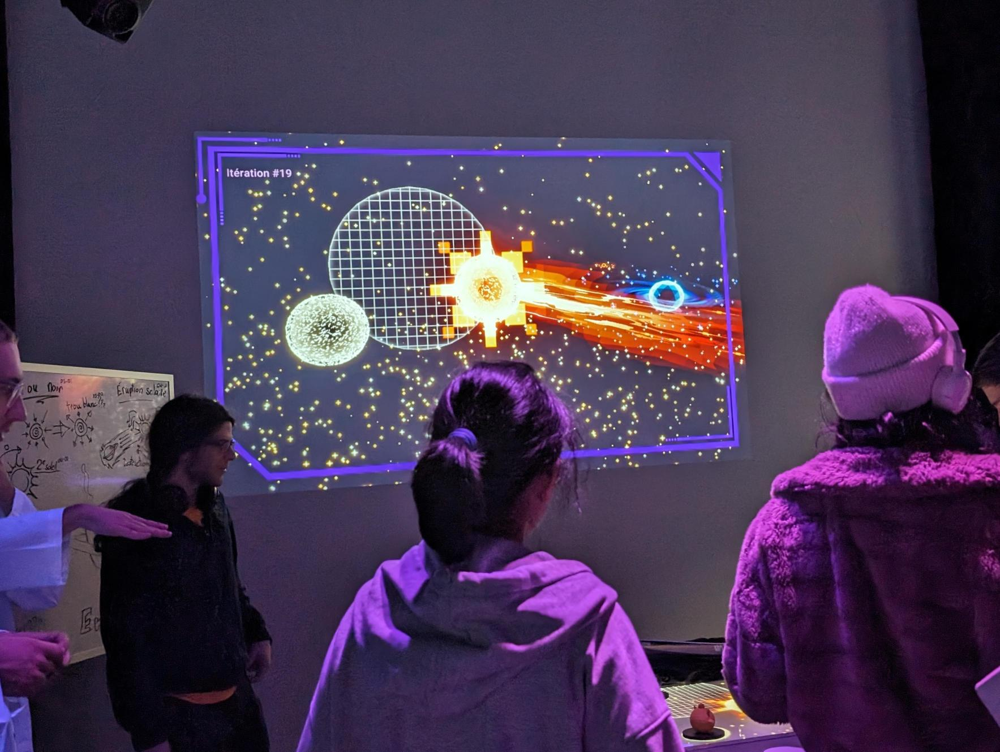

**Composantes et techniques:**  
Les artistes se servent de la kinect qui détectent des codes en dessous des statues pour connaitre leur identité et leurs positions.

**Éléments nécessaires à la mise en exposition:**
- Imprimante 3D
- Table et écran
- Kinect

**Ce que j'ai aimé 👍:** 
- Intéraction des planètes
- Corrélation des statues et de l'écran

**Ce que j'ai pas aimé 👎:** 
- Fils et kinect sont mal cachés

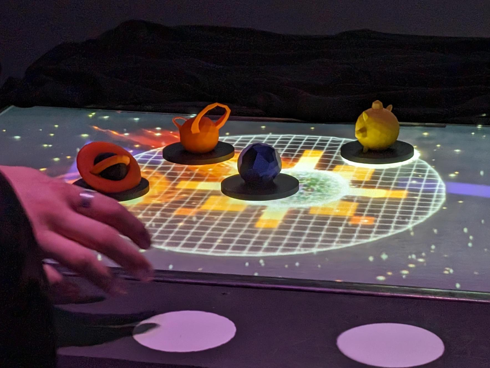

#Extras

## 3 Programmes essentiels pour réaliser ces projets
- Intéractivité ludique
- Installation Multimédia
- Conception d'une expérience multimédia

## Technique
La kinect, originellement développé par Microsoft pour la console de jeu Xbox, est utilisé pour plusieurs oeuvres de Crescentia. Elle projette des points et utilise un capteur pour détecter la profondeur des personnes ou des objets devant. Cette information est ensuite utilisé dans des programmes pour savoir la position qui permet d'interagir avec l'oeuvre.

## Rang des oeuvres
1. Canevas Cosmique: Bonne intéractivité, figurines, style artistique
2. Effet Papillon: Concept ingénieux, ambiance intéressante
3. Kigo: Esthétique intéressant, très intéractif
4. Sonalux: Bon ambiance
5. Rhizomatique: Exécution de l'idée décevant, usage unique de mèche

## Références
<https://tim-montmorency.com/2024/>  
<https://tim-montmorency.com/2024/projets/Rhizomatique/docs/web/index.html>  
<https://tim-montmorency.com/2024/projets/Effet-Papillon/docs/web/index.html>  
<https://tim-montmorency.com/2024/projets/Kigo/docs/web/index.html>  
<https://tim-montmorency.com/2024/projets/Sonalux/docs/web/index.html>  
<https://tim-montmorency.com/2024/projets/Canevas-Cosmique/docs/web/index.html>
