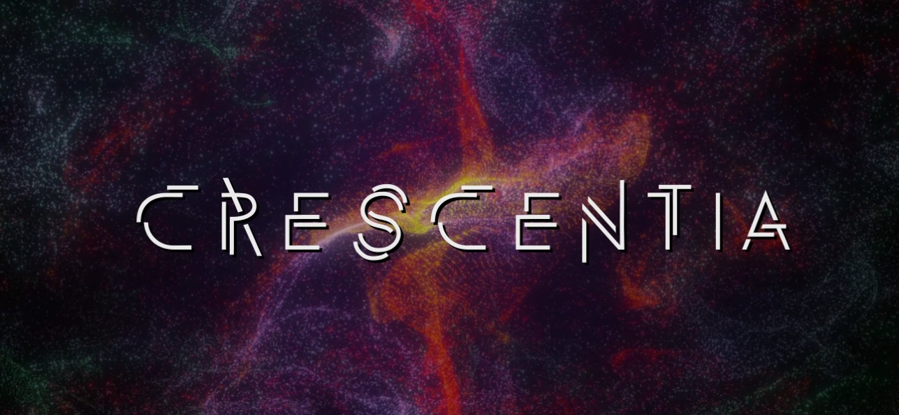
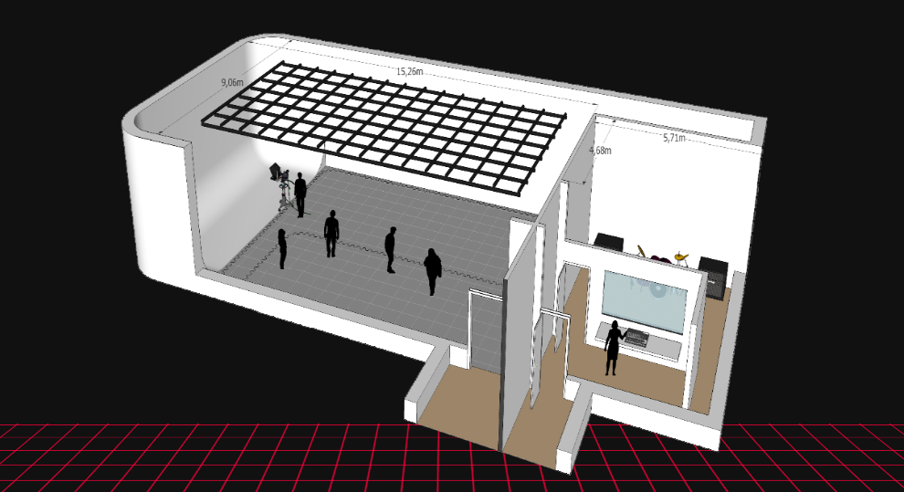
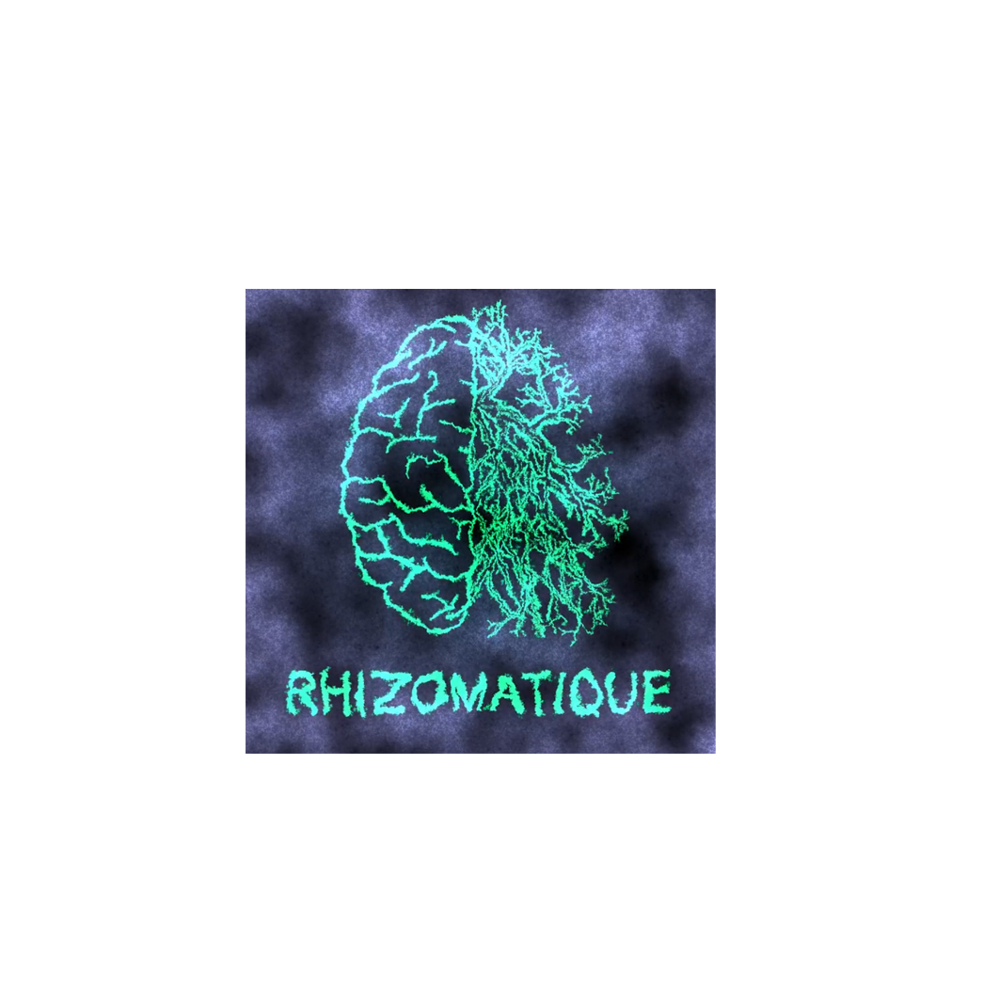
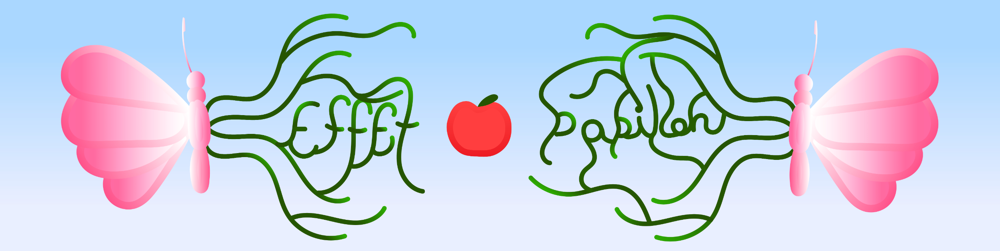
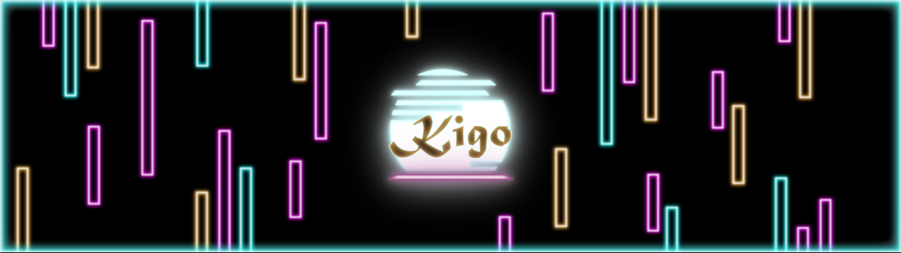
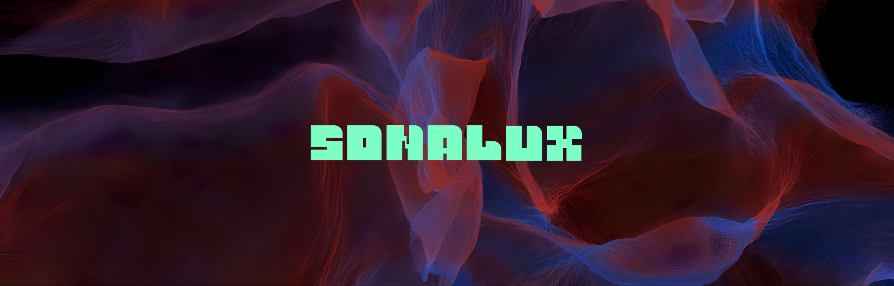

# Crescentia 
## Qu'est-ce Crescentia? 
Crescentia est un projet dirigé par les étudiants du programme TIM (Technique Integration Multimédia). Ce projet comporte de oeuvres d'expositions. 3 de ces oeuvres utilise de la technologie kinect (technologie projection laser rayon rouge).

### Info de visite
- **Date de visite:** 20 fevrier (1re)
- **Lieu de mise en exposition:** grand studio et petit studio
- **Année de réalisation:** 2024
- **Type d'exposition:** temporaire, intérieure
- **Type d'installation:** interactive

### Mise en espace
Grand studio (pièce à gauche) et Petit studio (pièce à droite)

- Rhizomatique occupe le coté gauche du grand studio, ils utilisent une zone de controle en mèshe et le cyclorama pour afficher l'image
- Effet Papillon occupe toute l'espace derrière la vitre dans le petit studio
- KIGO occupe le devant du grand studio, ils utilisent une zone au sol marqué par du ruban adhésif et le mur pour afficher l'image
- Sonalux occupe le fond du grand studio, ils utilisent deux petits mur en combinaison du mur de fond pour faire un cubicule afin d'afficher l'image avec un panneau de contrôle
- Canevas Cosmique occupe la droite du grand studio, ils utilisent une table (le canevas) et le mur droit pour afficher l'image

# Rhizomatique
Membres: Jolyanne Desjardins, MaÏka Désy, Laurie Houde, Felix Testa Radovanovic, 

**Description de l'oeuvre:**    
**Composants et techniques:**   
**Éléments nécessaires à la mise en exposition:**    
**Expérience vécue:**    
**Ce que j'ai aimé 👍:**    
**Ce que j'ai pas aimé 👎:**    

# Effet Papillon
Membres: Raphaël Dumont,  Alexis Bolduc,  William Morel, Alexia (Ryan) Papanikolaou, Viktor Zhuralev, Jasmine Lapierre

**Description de l'oeuvre:**   
**Composants et techniques:**   
**Éléments nécessaires à la mise en exposition:**    
**Expérience vécue:**    
**Ce que j'ai aimé 👍:**    
**Ce que j'ai pas aimé 👎:**    

# KIGO
Membres: Érick Ouellette, William Rathier Mailly, Gabriel Clerval, Nicolas St-Martin, Antoine Dion

**Description de l'oeuvre:**    
**Composants et techniques:**   
**Éléments nécessaires à la mise en exposition:**    
**Expérience vécue:**    
**Ce que j'ai aimé 👍:**    
**Ce que j'ai pas aimé 👎:**    

# Sonalux
Membres: Antoine Haddad, Camélie Laprise, Ghita Alaoui, Vincent Desjardins, 

**Description de l'oeuvre:**    
**Composants et techniques:**   
**Éléments nécessaires à la mise en exposition:**    
**Expérience vécue:**    
**Ce que j'ai aimé 👍:**    
**Ce que j'ai pas aimé 👎:**    

# Canevas Cosmique
Membres: Jacob Alarie-Brousseau, Étienne Charron, Jérémy Cholette, Quoc Huy Do, Mikaël Tourangeau

**Description de l'oeuvre:**    
**Composants et techniques:**   
**Éléments nécessaires à la mise en exposition:**    
**Expérience vécue:**    
**Ce que j'ai aimé 👍:**    
**Ce que j'ai pas aimé 👎:**    

Sources:  
TIM Montmorency - <https://tim-montmorency.com/2024/>
