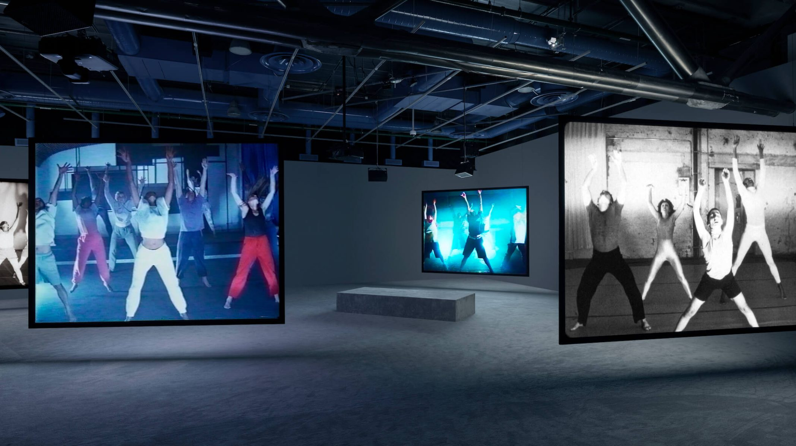
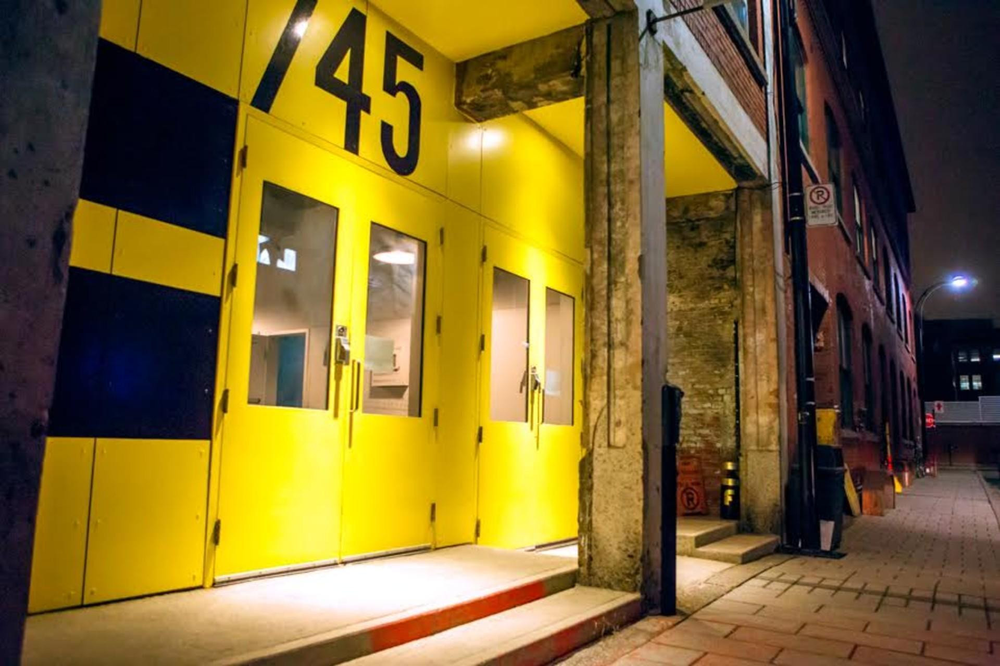
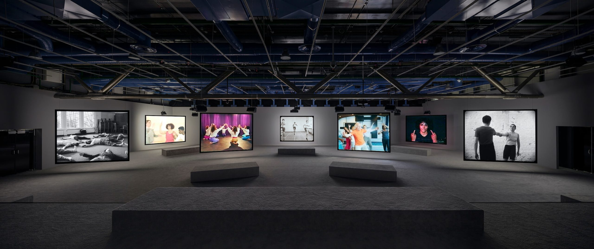
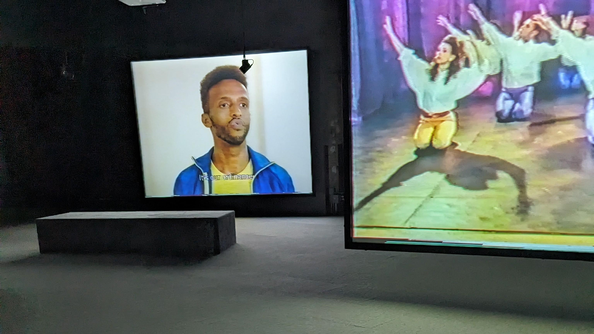
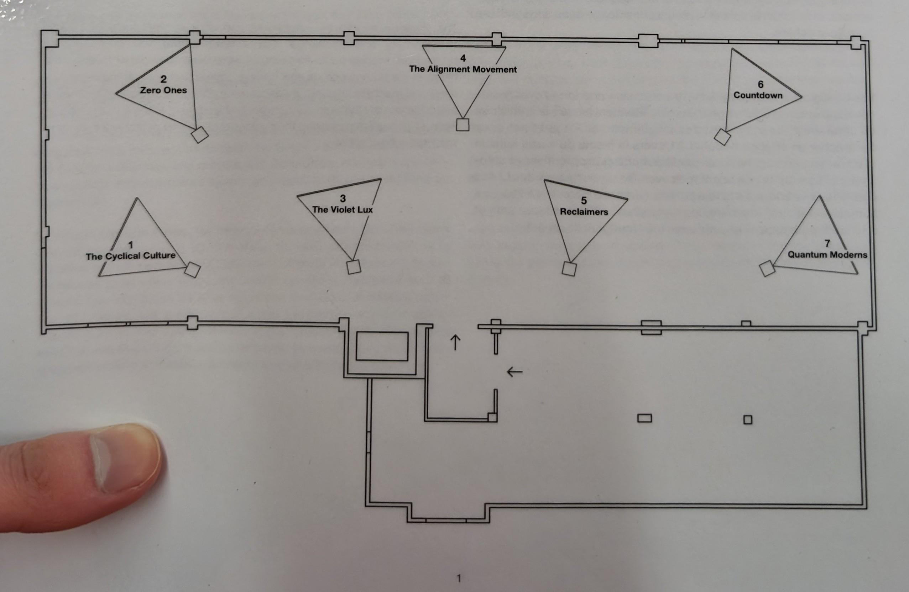
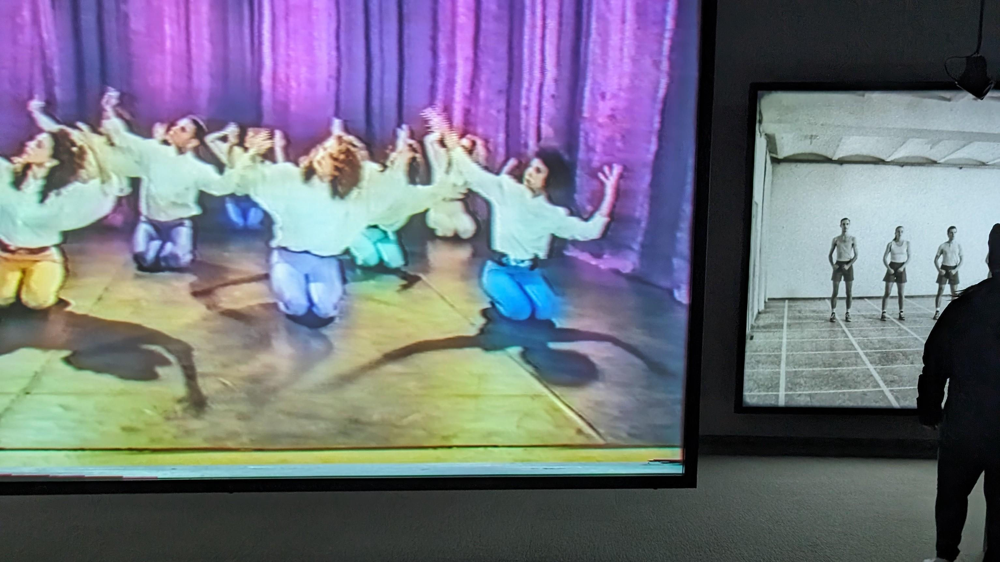
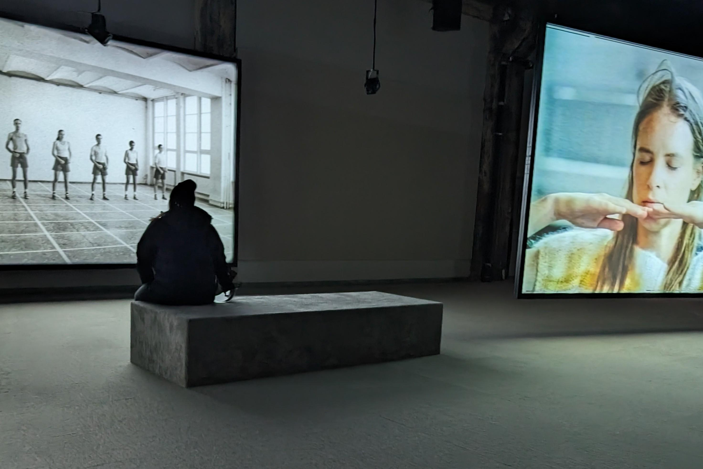

# Phase Shifting Index - Jeremy Shaw

### Nom de l'exposition ou de l'événement
La Fonderie Darling

Source: macm.org
 

### Lieu de mise en exposition
La Fonderie Darling

Source: fonderiedarling.org
 

### Type d'exposition
Temporaire (12 décembre 2023 - 25 février 2024)
 

### Date de votre visite
2 février 2024
 

### Titre de l'oeuvre
Phase Shifting Index

Source: Timo Ohler
 

### Nom de l'artiste
Jeremy Shaw

Source: Alex De Brabant
 

### Année de réalisation	
2020

### Description de l'oeuvre	
Phase Shifting Index par Jeremy Shaw est un oeuvre immersif qui explore les themes d'ascension à un état psychédelique. 
L'oeuvre contient 7 écrans montrant des personnes qui effectuent chacun des styles de danses différents dans une période de temps différente.
L'oeuvre finit en synchronisant tout les ecrans et melanges les elements avec du editing pour créer une expérience surréel.

### Type d'installation
Immersive

### Mise en espace	

En rentrant à la pièce on voit les écrans de numéro impair placés en avant et les écrans de numéro pair derrière. Au long du mur de l'entré réside un longue estrade pour s'asseoir. De plus, il y a des bancs devant les écrans et des hauts parleurs au dessus de ces bancs.

### Composantes et techniques	
Jeremy Shaw semble avoir filmé tout les scenes en meme temps à cause de la synchronisation et des personnes qui changeaient d'écran à la fin de l'exposition.
Si ce n'est pas le cas, j'imagine qu'il les ont filmés dans des instances différentes mais s'est servi du chaos visuel pour faire passer son montage.

### Éléments nécessaires à la mise en exposition	
- tapis
- 7 écrans
- salle spacieux
- haut-parleurs suspendus
- cables
- bancs
- estrades

souce: macm.org

### Expérience vécue	
Les participants sont invités à ne pas rester sur les estrades mais plutôt de ce déplacer. Il y a des bancs devant chaque écran pour nous inciter à prendre le temps de payer attention à chaque écran et mieux entendre le son qui est fourni par les haut parleurs suspendu juste au-dessus de ceci.
Les participants sont ensuite invités a rester aux estrades pour avoir un vu complet de tout les écrans afin de remarquer des détails. 

### Ce qui m'a plus

### Éléments que j'ai moins apprécié

### Références:
<https://macm.org/expositions/jeremy-shaw/>
<https://fonderiedarling.org/en/mandate>

