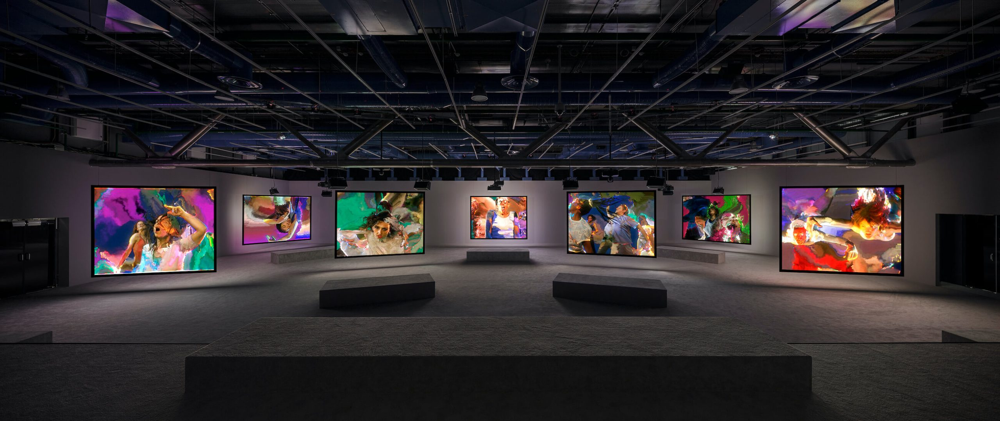

# Phase Shifting Index - Jeremy Shaw

## Nom de l'exposition ou de l'événement
La Fonderie Darling

Source: macm.org
 

## Lieu de mise en exposition
La Fonderie Darling

Source: fonderiedarling.org
 

## Type d'exposition
Temporaire (12 décembre 2023 - 25 février 2024)
 

## Date de votre visite
2 février 2024
 

## Titre de l'oeuvre
Phase Shifting Index

Source: Timo Ohler
 

## Nom de l'artiste
Jeremy Shaw

Source: Alex De Brabant
 

## Année de réalisation	
2020

## Description de l'oeuvre	
Phase Shifting Index par Jeremy Shaw est un oeuvre immersif qui explore les thèmes d'ascension à un état psychédélique. 
L'oeuvre contient 7 écrans montrant des personnes qui effectuent chacun des styles de danses différentes dans une période de temps différente.
L'oeuvre finit en synchronisant tous les écrans et en mélangeant les éléments avec du montage pour créer une expérience sur-réel.

## Type d'installation
Immersive

## Mise en espace	

En rentrant à la pièce on voit les écrans de numéro impair placés en avant et les écrans de numéro pair derrière. Au long du mur de l'entrée réside une longue estrade pour s'asseoir. De plus, il y a des bancs devant les écrans et des hauts parleurs au-dessus de ces bancs.

## Composantes et techniques	
Jeremy Shaw semble avoir filmé tous les scènes en même temps à cause de la synchronisation et des personnes qui changeaient d'écran à la fin de l'exposition.
Si ce n'est pas le cas, j'imagine qu'il les avait filmés dans des instances différentes mais s'est servi du chaos visuel pour faire passer son montage.

## Éléments nécessaires à la mise en exposition	
- tapis
- 7 écrans
- salle spacieuse
- haut-parleurs suspendus
- cables
- bancs
- estrades

souce: macm.org

## Expérience vécue	
Les participants sont invités à ne pas rester sur les estrades, mais plutôt de se déplacer. Il y a des bancs devant chaque écran pour nous inciter à prendre le temps de faire attention à chaque écran et mieux entendre le son qui est fourni par les haut-parleurs suspendus juste au-dessus de ceci.
Les participants sont ensuite invités a rester aux estrades pour avoir un vu complet de tous les écrans afin de remarquer des détails. 

## Ce qui m'a plus
J'ai bien apprécié la dernière partie de l'oeuvre. C'était sans doute la partie la plus captivante et fascinante. J'ai aussi aimé le passé des personnages de l'oeuvre qui approfondi l'univers créé par Jeremy Shaw. Sa rajoute des détails qu'on peut apprécier à deuxième vu et ça ferait pour une histoire intéressante pour une série. 

## Éléments que j'ai moins apprécié
Je pense que l'utilisation de 7 écrans n'est pas si intéressants et l'ambiguité de l'histoire moins pertinent. J'ai plus aimé lire sur l'histoire que voir le début de l'oeuvre qui me paraissait assez long et ennuyant.

## Références:
<https://macm.org/expositions/jeremy-shaw/>
<https://fonderiedarling.org/en/mandate>

