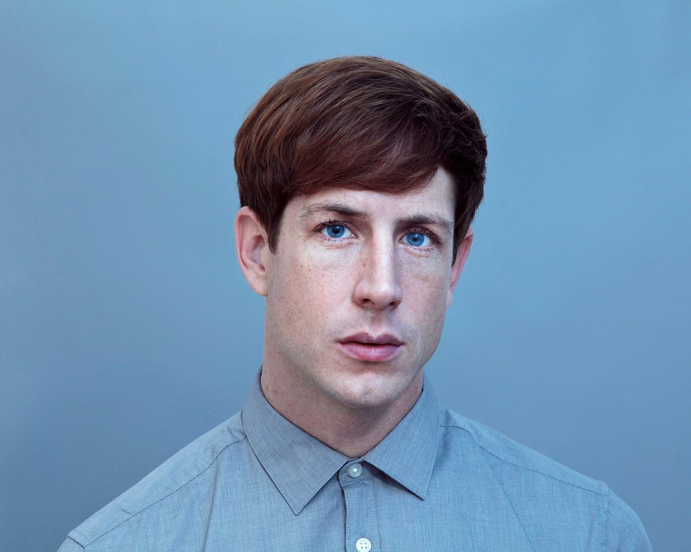

# Phase Shifting Index - Jeremy Shaw

### Nom de l'exposition ou de l'événement
La Fonderie Darling

Source: La Fonderie Darling

### Lieu de mise en exposition
La Fonderie Darling

Source: followartwithus.com

### Type d'exposition
Temporaire (12 décembre 2023 - 25 février 2024)

### Date de votre visite
2 février 2024

### Titre de l'oeuvre
Phase Shifting Index

Source: Timo Ohler

### Nom de l'artiste
Jeremy Shaw

Source: Alex De Brabant

### Année de réalisation	
2020

### Description de l'oeuvre	
Phase Shifting Index par Jeremy Shaw est un oeuvre immersif qui explore les themes d'ascension à un état psychédelique. 
L'oeuvre contient 7 écrans montrant des personnes qui effectuent chacun des styles de danses différents dans une période de temps différente.
L'oeuvre finit en synchronisant tout les ecrans et melanges les elements avec du editing pour créer une expérience surréel.

### Type d'installation
Immersive

### Mise en espace	
7 écrans
estrades et sol poilu
salle assez spacieux
banc
speakers pendus

### Composantes et techniques	

### Éléments nécessaires à la mise en exposition	

### Expérience vécue	
Les participants sont invités à ne pas rester sur les estrades mais plutôt de ce déplacer. Il y a des bancs devant chaque écran pour nous inciter à prendre le temps de payer attention à chaque écran et mieux entendre le son qui est fourni par les haut parleurs suspendu juste au-dessus de ceci.
Les participants sont ensuite invités a rester aux estrades pour avoir un vu complet de tout les écrans afin de remarquer des détails. 

Références:

