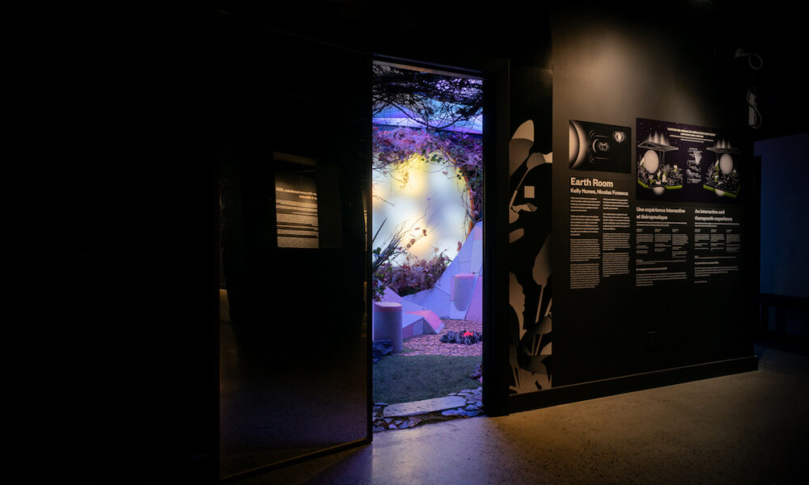
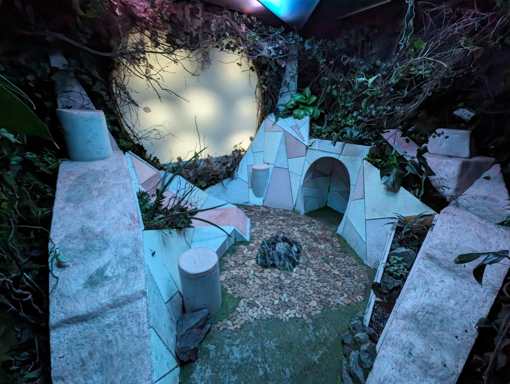
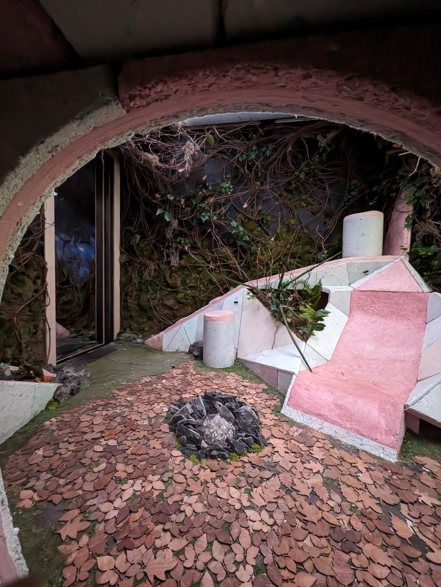
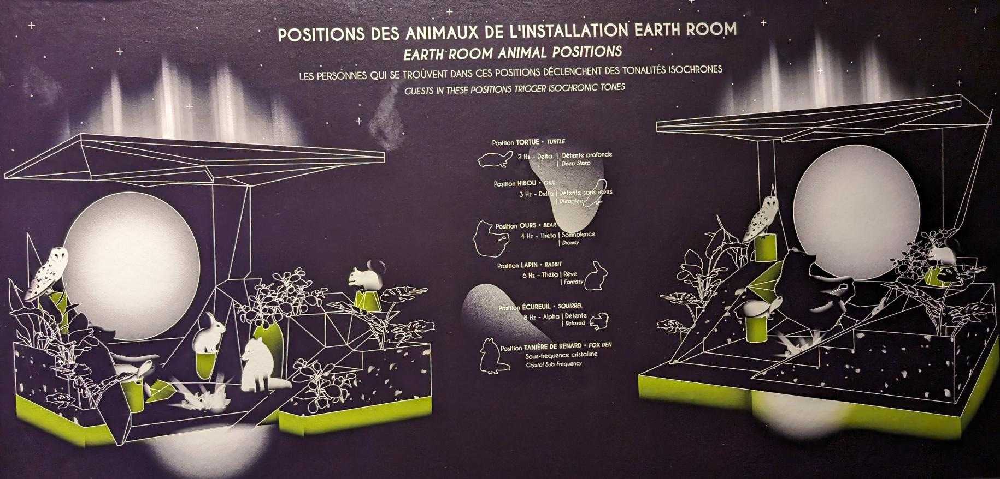
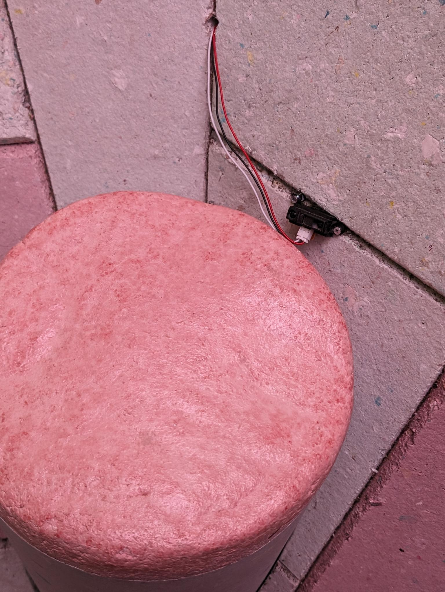

# Earth Room

## Nom de l'exposition ou de l'événement
Earth Room

## Lieu de mise en exposition
Age of Union

## Type d'exposition
Permanent

## Date de visite
2 mars 2024
 
## Titre de l'oeuvre
Earth Room

 
## Nom de l'artiste
 Kelly Nunes, Nicolas Fonseca

## Année de réalisation	
2021

## Description de l'oeuvre
Earth Room est une chambre visant a simuler une foret. Il sert a invoquer des sentiments de connection avec la nature et a reproduire un environnement calmant et relaxant pour nous détendre qui peut être thérapeutique. Pour faire cela elle incorpore des bruits de feuilles, de pluie et de tonnerre. Les sons sont diversifiés selon quel siège le visiteur décide de s'asseoir. Chaque siège (les cylindres) est assigné à un animal et en s'asseyant sur une siège nous permet de simuler l'expérience de l'animal.

## Type d'installation
Immersive

## Fonction du dispositif
Scénographique

## Mise en espace
Earth Room se situe dans une petite piece a Age of Union. La salle est ferme est comprend une porte en miroir.

## Composantes et techniques
- capteurs
- lumieres LED
- micros

## Éléments nécessaires à la mise en exposition
- Morceaux de l'environnement (Roches, feuilles, plantes)
- tabourets

## Expérience vécue
Le visiteur est attendu a s'asseoir sur les tabourets et se sentir parti de l'environnement. 
C'est une experience serene.

## Ce qui m'a plus
Le concept est intéressant et bien executé. Ambiance apaisant et immersif.

## Éléments que j'ai moins apprécié
Certains tabourets étaient mal positionnés. J'avais des feuilles dans mon visages dans sur quelques sièges.

## Références:
<https://kellynunes.com/Earth-Room>
<https://ageofunion.com/>
