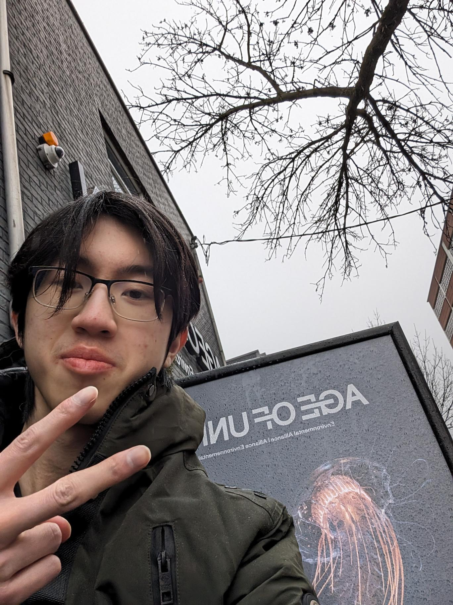

# Earth Room

## Nom de l'exposition ou de l'événement
**Earth Room**

## Lieu de mise en exposition
Age of Union

## Type d'exposition
Permanent

## Date de visite
2 mars 2024
 
## Titre de l'oeuvre
**Earth Room**

 
## Nom de l'artiste
 Kelly Nunes, Nicolas Fonseca

## Année de réalisation	
2021

## Description de l'oeuvre
Earth Room est une chambre visant à simuler une forêt. Il sert à invoquer des sentiments de connexion avec la nature et à reproduire un environnement calmant et reposant pour nous détendre qui peut être thérapeutique. Pour faire cela elle incorpore des bruits de feuilles, de pluie et de tonnerre. Les sons sont diversifiés la position du visiteur. Chaque siège (les tabourerts) est assigné à un animal et en s'asseyant sur un siège nous permet de simuler l'expérience de l'animal. L'environnement est fabriqué de papier usé, de terre et de vraies plantes

## Type d'installation
Immersive

## Fonction du dispositif
Scénographique

## Mise en espace
Earth Room se situe dans une petite pièce à Age of Union. La salle est fermé et comprend une porte en miroir.

## Composantes et techniques
- capteurs
- lumieres LED
- micros

## Éléments nécessaires à la mise en exposition
- Morceaux de l'environnement (Papier, feuilles, plantes)
- tabourets

## Expérience vécue
Le visiteur est attendu à s'asseoir sur les tabourets et se reposer dans l'environnement. 
C'est une expérience sereine. J'ai assez bien apprécié mon temps.

## Ce qui m'a plus
Le concept est intéressant et bien exécuté. Ambiance apaisant et immersif.
Les matériels utilisés (papiers usé) donne un côté authentique à l'oeuvre.

## Éléments que j'ai moins apprécié
Certains tabourets étaient mal positionnés. J'avais des feuilles dans mon visage sur quelques sièges. Manque de confort pour une expérience "reposante". Emplacements moins évidents.

## Références:
<https://kellynunes.com/Earth-Room>
<https://ageofunion.com/>
